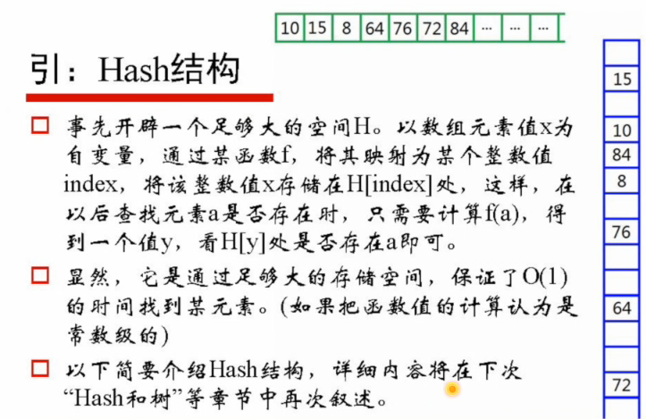

# 1. Two Sum

## Description

```
Difficulty: Easy
Total Accepted:580.8K
Total Submissions:1.7M
Contributor: LeetCode
```

Given an array of integers, return indices of the two numbers such that they add up to a specific target.

You may assume that each input would have exactly one solution, and you may not use the same element twice.

**Expample:**

```
Given nums = [2, 7, 11, 15], target = 9, Because nums[0] + nums[1] = 2 + 7 = 9, 
 return [0, 1].
```

***

## Solution1

  最直接的想法就是遍历所有解空间，然后判断遍历到的两个值的和是不是等于我们要求的值。这里使用了穷举法，也就是遍历了所有解空间，然后得到所求的解, 这应该是最直接的方式了，所以时间复杂度也相对较高。

```java
public class Solution {
    public int[] twoSum(int[] nums, int target) {
        for(int i=0; i<nums.length-1; i++){
            for(int j=i+1; j <nums.length; j++){
                if(nums[i] + nums[j] == target)
                    return new int[]{i,j};
            }
        }
        return null;
    
    }
}
```

时间复杂度为 : $O(n^2).$


## Solution2 

  这里的改进方式主要的思想是， 时空互换 ，通过建立一个HashTable或者HashMap来存储数组中的值以及其对应的位置，也就是说将数组元素的值当做Key,位置当做Value。相应的，我们对问题进行转化，加法转化为减法，什么意思呢，求解nums[i] + num[j] == target, 满足这个条件的 i j。我们转化为 nums[i] = target - nums[j]，也就是我们固定一个值 nums[j]， 通过条件联立（减法），去求解另一个值，而减法得到的值正好可以作为Hash的Key去搜索，该搜索的时间复杂度为O(1)，所以我们只需要一次遍历数组，每次遍历的时候去搜索target - nums[j]即可。



```java

public int[] twoSum(int[] numbers, int target) {
    int[] result = new int[2];
    Map<Integer, Integer> map = new HashMap<Integer, Integer>();
    for (int i = 0; i < numbers.length; i++) {
        if (map.containsKey(target - numbers[i])) {
            result[1] = i + 1;
            result[0] = map.get(target - numbers[i]);
            return result;
        }
        map.put(numbers[i], i + 1);
    }
    return result;
}
```

***

**enjoy life, coding now! :D**
