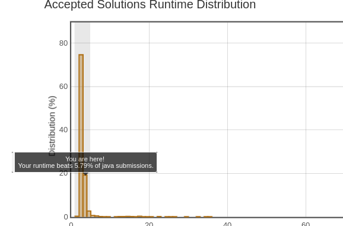

#  231. Power of Two

## Description

```
Difficulty: Easy
Total Accepted:140.8K
Total Submissions:350.9K
Contributor: LeetCode
```

Given an integer, write a function to determine if it is a power of two.

***

## Solution1
 我的思路是如果这个数对2取余为1，就不是2的幂。依次类推，让这个数一直除以2，每一次都判断一下得到的数对2取余是否为1，如果是的话就返回false。提交后虽然AC了，但是结果不是很理想。。:sweat:

```java
public class Solution {
    public boolean isPowerOfTwo(int n) {
        if( n <= 0)
            return false;
        if(n == 1 || n == 2)
            return true;
        while(n > 1){
            if(n % 2 == 1)
                return false;
            n /= 2;
        }
        return true;
    }
}
```

***
我们先来看看上一种答案提交后的排名结果：



弱爆了有没有。。。。:no_mouth:

## Solution2
 那么我们该怎么改进了，这里用到了一个技巧和一个看待数值的角度，首先，看待2的幂之类的数值，尽量用2进制的角度去看， 这是一种经验，2的幂，在二进制的域里表现得及其有规律，而且和计算机运算结合非常紧密，我们结合这道题，看看换一种域看待数值，会有什么新的发现：

这里是二进制的世界：

| 数值   | 二进制表示 |
| ---- | ----- |
| 2    | 10    |
| 4    | 100   |
| 8    | 1000  |

从以上表格可以看出2的幂在二进制下的规律就是最高位为1，其他位为0，然后再用一下技巧就可以求解这道题了，这个技巧就是把2的幂减去1得到的二级制是最高位为0其他位为1的，这样将减1后的二进制和原二级制作与操作，如果全为0，那么可以断定，这个数是二进制的幂。

```java
public class Solution {
    public boolean isPowerOfTwo(int n) {
        if( n <= 0)
            return false;
        return (n&(n-1)) == 0;
    }
}
```

***

**enjoy life, coding now! :D**


