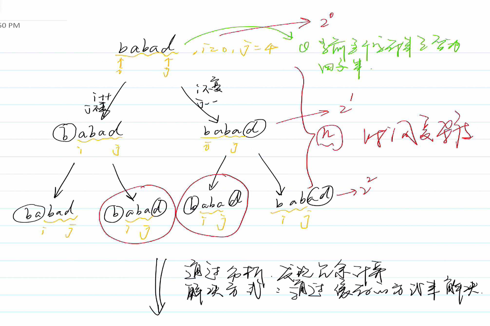

# 5. Longest Palindromic Substring
## #1 对称法[AC]
由于回文串的特殊性，它的主要矛盾点在于回文串是关于中心点对称的，但是存在两种情况

1. aba 这种有中心元素的
2. bb 这种没有中心元素的

那么，我们在设计算法的时候，我们可以遍历字符串里面的每个字符，然后考虑以该字符作为中心元素，或者最靠近中心点的元素来枚举出以该元素为中心可能的最长的回文子串。这样的时间复杂为 O(n^2), 这在字符串子串问题里面是可以接受的。

接触了不少的回文串的问题了，我们可以总结一下回文串的一般规律:

1. 关于中心点（这里的中心点不一定指中心元素）的其他元素是对称的，这就意味着他们的统计信息（个数）都是偶数，当然排除中心元素外。
2. 考虑回文串的时候要分两种情况，一是有中心元素的如 aba， 二是没有中心元素的 如 bb
3. 一般回文串的算法都要设置两个指针，做对称位置的元素判断。


```java

class Solution {
    public String longestPalindrome(String s) {
        // I
        if(s == null || s.length() == 0)
            return "";
        if(s.length() == 1)
            return s;
        
        //II
        int low = 0;
        int maxLen = 1;
        for(int i=0; i<s.length()-1; i++){
            if(i-1>=0 && s.charAt(i-1) == s.charAt(i+1)){
                int j = i-1;
                int k = i+1;
                while(j>=0&&k<s.length()&&s.charAt(j)==s.charAt(k)){
                    j--;
                    k++;
                }
                if(maxLen < k-j-1){
                    maxLen = k - j -1;
                    low = j + 1;
                }
            }
            if(s.charAt(i) == s.charAt(i+1)){
                int j = i;
                int k = i+1;
                 while(j>=0&&k<s.length()&&s.charAt(j)==s.charAt(k)){
                    j--;
                    k++;
                }
                if(maxLen < k-j-1){
                    maxLen = k - j -1;
                    low = j + 1;
                }
            }
        }
        return s.substring(low, low + maxLen);
    }
}
```

## #2 递归求解法[TLE]

可以定义递归方程式来求解该问题，递归时的计算因子为: 1. 判断当前字符串是否为回文；2. 求解 $S_{i+1, j}$的最大回文串; 3. 求解$S_{i, j-1}$的最大回文串；4. 返回以上三种情况中最大的子串。

```java
class Solution {
    private String robot(String s, int i, int j){
        if(i == j)
            return s.substring(i, j+1);
        String cur = isPalindrome(s, i, j) ? s.substring(i, j+1) : "";
        if(!cur.equals(""))
            return cur;
        String left = robot(s, i+1, j);
        String right = robot(s, i, j-1);
        return left.length() > right.length() ? left : right;
    }
    
    private boolean isPalindrome(String s, int start, int end){
        for(int i=start, j=end; i<j; i++, j--){
            if(s.charAt(i) != s.charAt(j))
                return false;
        }
        return true;
    }
    
    public String longestPalindrome(String s) {
        return robot(s, 0, s.length() - 1);
    }
}
```

 算法的时间复杂度为$O(2^n)$，

从上图的递归树中，我们发现了冗余的计算，下面代码通过建立缓存来消除冗余计算:

```java
class Solution {
    class Pair{
        int i;
        int j;
        public Pair(int i, int j){
            this.i = i;
            this.j = j;
        }
        
        public boolean equals(Object obj){
            if(!(obj instanceof Pair))
                return false;
            return this.i == ((Pair)obj).i && this.j == ((Pair)obj).j;
        }
        
        public int hashCode(){
            return i*37 + j;
        }
    }
    Map<Pair, String> cache = new HashMap<>();
    private String robot(String s, int i, int j){
        if(i == j)
            return s.substring(i, j+1);
        if(cache.containsKey(new Pair(i, j)))
            return cache.get(new Pair(i, j));
        String cur = isPalindrome(s, i, j) ? s.substring(i, j+1) : "";
        if(!cur.equals(""))
            return cur;
        String left = robot(s, i+1, j);
        String right = robot(s, i, j-1);
        String result =  left.length() > right.length() ? left : right;
        cache.put(new Pair(i, j), result);
        return result;
    }
    
    private boolean isPalindrome(String s, int start, int end){
        for(int i=start, j=end; i<j; i++, j--){
            if(s.charAt(i) != s.charAt(j))
                return false;
        }
        return true;
    }
    
    public String longestPalindrome(String s) {
        return robot(s, 0, s.length() - 1);
    }
}
```

虽然进行的优化，提交的时候还是超时了，说明递归求解本身的时间复杂度过高了。下面，我们换一种思想， 通过分析题目本身的特点，我们用动态规划来求解。

## #3 动态规划[AC]

我们发现，对于 `cbabc` 这样的输入，当我们判断s[0] == s[4]，即判断出两边的字符都是c的时候，我们可以通过判断内部的子串(即bab)是否是回文，就可以判断当前的串是否为回文，当然了，如果两边的值不同，那么当前的串肯定就不是回文了。分析图如下:


通过以上分析，我们只要已知了内部子串的状态，就可以推出整个字符串的状态值了，代码如下:

```java
class Solution {
    public String longestPalindrome(String s) {
        //定义的状态 dp[][]   -> dp[i][j] == true S(i->j)是回文，否则不是
        int n = s.length();
        String res = null;
        boolean[][] dp = new boolean[n][n];
        
        for(int i=n-1; i>=0; i--){
            //已知的状态是 单个字符
            for(int j=i; j<n; j++){
                dp[i][j] = s.charAt(i) == s.charAt(j) && (j-i < 3 || dp[i+1][j-1]);
                if(dp[i][j] && (res == null || j-i+1 > res.length()))
                    res = s.substring(i, j+1);
            }
        }
        return res;
    }
}
```

代码执行的完整过程如下:


