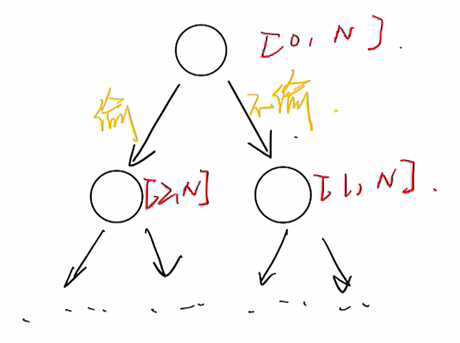
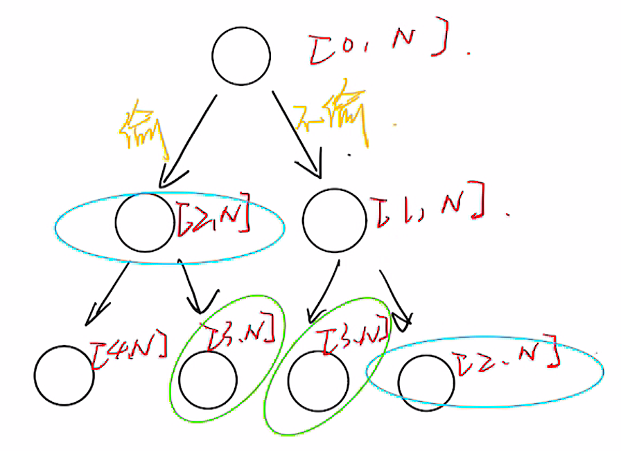

# 198. House Robber

## #1 递归[TLE]

首先解释一下这道题目的意思：你是一个小偷，要去盗取一排([0,N]个)房子的财产，每个房子都有nums[i]的财产可以盗取，你希望获得最多的财产，看到这里你可能会想全部都偷了不就最多了吗？是的，但是这道题目的限制条件是，不能有连续两个房子被偷。示意图如下:


题目分析完了，现在来看下怎么求解这道题目呢？

我的第一反应是递归求解，为什么呢？因为，每个房子都有偷与不偷两种情况，我们可以分类讨论，每一种讨论的情况，实际上求解的问题和原问题是一样的，只是问题的规模变小了。看一下下面的示意图可能比较的清楚:



好了，现在我们来实现一下代码:

```java
class Solution {
    public int rob(int[] nums) {
        return robot(0, nums);
    }
    
    public int robot(int idx, int[] nums){
        // 递归的终止条件
        if(idx >= nums.length){
            return 0;
        }
        int yes = nums[idx] + robot(idx+2, nums);
        int no = 0 + robot(idx+1, nums);
        return Math.max(yes, no);
    }
}
```

但是，当我们提交的时候会报超时错误，现在我们看一下，为什么会出现超时错误呢？或者说递归的弊端在哪里，该算法在哪个地方浪费了时间呢？请看下面的示意图:



## #2 递归+缓存[AC]

我们可以看到，对于一些状态值，递归的方法存在反复计算的问题，这个问题导致了递归算法时间的变长，怎么解决这个问题呢？通过时空互换的思想，我们可以建立一个缓存，将已经计算过的状态值保存起来，下次可以直接从缓存中获取而不需要重新计算。好了，我们改进递归的版本的，引入缓存:

```java
class Solution {
    Map<Integer, Integer> cache = new HashMap<>();
    
    public int rob(int[] nums) {
        return robot(0, nums);
    }
    
    public int robot(int idx, int[] nums){
        // 递归的终止条件
        if(idx >= nums.length){
            return 0;
        }
        if(cache.containsKey(idx))
            return cache.get(idx);
        int yes = nums[idx] + robot(idx+2, nums);
        int no = 0 + robot(idx+1, nums);
        int result = Math.max(yes, no);
        cache.put(idx, result);
        return result;
    }
}
```

好了，这个版本可以AC，我们做进一步的思考。我们是否可以通过动态规划直接求解呢？因为动态规划本质上也是对递归的过程做缓存，然后递推的进行转移，最后获得最终状态值的一种算法，下面引入动态规划求解:

## #3 动态规划[AC]

```java
class Solution {
    // 动态规划-> 1. 状态   2. 初始状态  3. 转移方程
    // 问题要求解的是 最终的状态
    public int rob(int[] nums) {
        int[][] dp = new int[nums.length+1][2];
        for(int i=1; i<=nums.length; i++){
            dp[i][0] = Math.max(dp[i-1][0], dp[i-1][1]);
            dp[i][1] = nums[i-1] + dp[i-1][0];
        }
        return Math.max(dp[nums.length][0], dp[nums.length][1]);
    }
}
```

